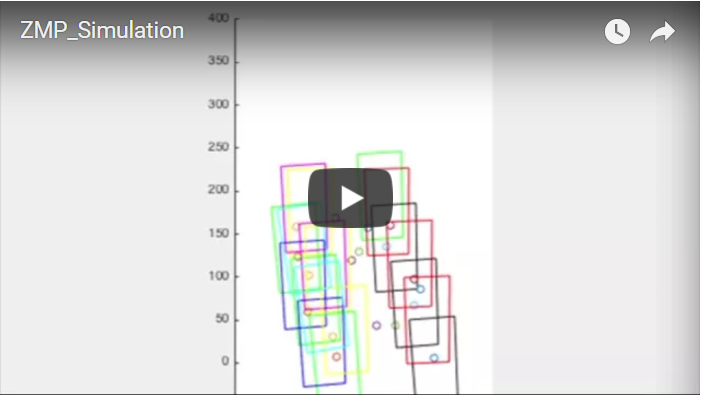
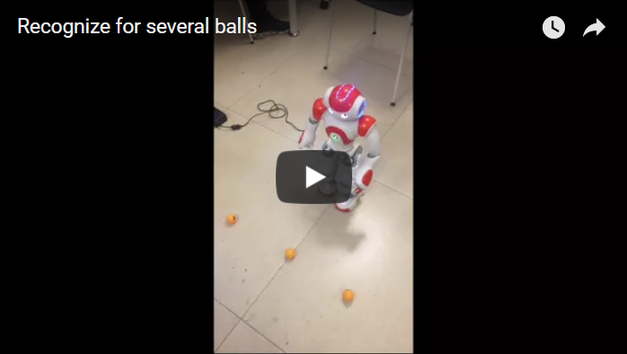

# What is this repository for? #

This repository contains a bunch of codes that we wrote to control the bipedal robot 'nao'. We adapt the ZMP theory to control the robot. Since there are several joints on the robot, we use the quaternions or rotation matrix to calculate the position and rotation of robot's foots and hands. However, we didn't find the analytic solutions of the equation. So we use numerical method to calculate the joints' angels when calculating the balls' direction. 

# Results #
## Images ##

### Simulation Result ###
 
### Finding several balls and kick the right one ###
 

## Videos ##

### Analysis of the gait planning using ZMP. The rectangle is the foot, and the points are zero moment point. ###

### The video presents that the robot recognizes several balls on the ground and we give it a instruction by the paper, then it goes to the designated ball and kicks it. ###

